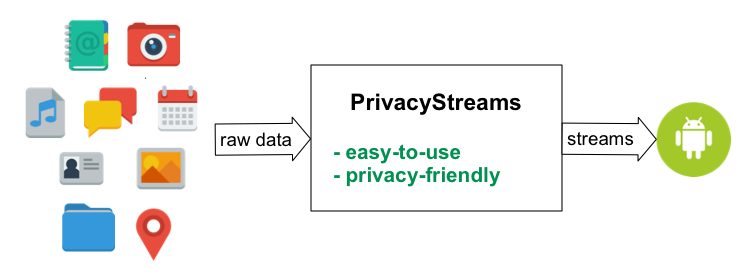

# PrivacyStreams

[](https://android-arsenal.com/api?level=16)
[](https://privacystreams.github.io/)
[ ](https://bintray.com/ylimit/PrivacyStreams/PrivacyStreams-Android-SDK/_latestVersion)
[](https://www.apache.org/licenses/LICENSE-2.0)

PrivacyStreams is an Android library for easy and privacy-friendly personal data access and processing. It offers a functional programming model for various types of personal data, including locations, photos, audios, sensors, contacts, messages, and more.

Cite (Bibtex):

```
@article{li)_imwut17_privacystreams,
  title={PrivacyStreams: Enabling transparency in personal data processing for mobile apps},
  author={Li, Yuanchun and Chen, Fanglin and Li, Toby Jia-Jun and Guo, Yao and Huang, Gang and Fredrikson, Matthew and Agarwal, Yuvraj and Hong, Jason I},
  journal={Proceedings of the ACM on Interactive, Mobile, Wearable and Ubiquitous Technologies},
  volume={1},
  number={3},
  pages={76},
  year={2017},
  publisher={ACM}

}
```

In PrivacyStreams, all types of personal data can be accessed and processed with a uniform query interface (UQI):

**UQI.getData(Provider, Purpose).transform(Transformation).output(Action)**

Where `Provider`, `Transformation`, `Action` are built-in functions and `Purpose` is a description to describe why the data is needed.
Developers only need to find the proper functions to form a query. They don't need to deal with the complicated data formats, multi-threading, runtime permissions, etc.

Based on the functions used in the query and the purpose specified by the developer, PrivacyStreams is able to generate a privacy description, which can be a part of the app description or the privacy policy to help users understand what personal data is used in the app and why.

## Quick examples

#### Get email addresses for all contacts.

```java
    /**
     * Get emails addresses for all contacts on the device.
     * Make sure the following line is added to AndroidManifest.xml
     * <uses-permission android:name="android.permission.READ_CONTACTS" />
     */
    public void getEmails(Context context) {
        try {
            List<List<String>> contactEmails = new UQI(context)
                    .getData(Contact.getAll(), Purpose.SOCIAL("recommend friends"))
                    .asList(Contact.EMAILS);
            // Do something with contact emails
            System.out.println("Contact emails: " + contactEmails);
        } catch (PSException e) {
            e.printStackTrace();
        }
    }
```

#### Get the current location.

```java
    /**
     * Get the current location.
     * Make sure the following line is added to AndroidManifest.xml
     * <uses-permission android:name="android.permission.ACCESS_COARSE_LOCATION" />
     */
    public void getCurrentLocation(Context context) {
        try {
            LatLon latLon = new UQI(context)
                    .getData(Geolocation.asCurrent(Geolocation.LEVEL_CITY), Purpose.UTILITY("check weather"))
                    .getFirst(Geolocation.LAT_LON);
            // Do something with geolocation
            Log.d("Location", "" + latLon.getLatitude() + ", " + latLon.getLongitude());
        } catch (PSException e) {
            e.printStackTrace();
        }
    }
```

#### Monitor location updates.

```java
    private static final double CENTER_LATITUDE = 40;
    private static final double CENTER_LONGITUDE = -80;
    private static final double RADIUS = 20.0;

    /**
     * Monitor location updates and callback when in a circular area.
     * Make sure the following line is added to AndroidManifest.xml
     * <uses-permission android:name="android.permission.ACCESS_FINE_LOCATION" />
     */
    public void geofence(Context context) {
        new UQI(context)
                .getData(Geolocation.asUpdates(10*1000, Geolocation.LEVEL_EXACT), Purpose.GAME("notify user"))
                .setField("inRegion", GeolocationOperators.inCircle(Geolocation.LAT_LON, CENTER_LATITUDE, CENTER_LONGITUDE, RADIUS))
                .onChange("inRegion", new Callback<Boolean>() {
                    @Override
                    protected void onInput(Boolean inRegion) {
                        // Do something when enters/leaves region.
                        Log.d("Geofence", inRegion ? "entering" : "leaving");
                    }
                });
    }
```

#### Wait and read incoming SMS messages.

```java
    private static final String SERVER_PHONE_NUMBER = "123456789";
    private static final String AUTH_MESSAGE_PREFIX = "Your code is ";

    /**
     * Wait for SMS messages and read the auth code
     * Make sure the following line is added to AndroidManifest.xml
     * <uses-permission android:name="android.permission.RECEIVE_SMS" />
     */
    public void readAuthSMS(Context context) {
        new UQI(context).getData(Message.asIncomingSMS(), Purpose.UTILITY("two-factor authentication"))
                .filter(Message.TYPE, Message.TYPE_RECEIVED)
                .filter(Message.CONTACT, SERVER_PHONE_NUMBER)
                .filter(StringOperators.contains(Message.CONTENT, AUTH_MESSAGE_PREFIX))
                .ifPresent(Message.CONTENT, new Callback<String>() {
                    @Override
                    protected void onInput(String text) {
                        String authCode = text.substring(13);
                        // Do something with the auth code
                        Log.d("Auth code", authCode);
                    }
                });
    }
```

#### Get local images in media storage.

```java
    /**
     * Get local images in media storage.
     * Make sure the following line is added to AndroidManifest.xml
     * <uses-permission android:name="android.permission.READ_EXTERNAL_STORAGE" />
     */
    public void getLocalImages(Context context) {
        try {
            List<String> filePaths = new UQI(context)
                    .getData(Image.getFromStorage(), Purpose.UTILITY("read photos"))
                    .setField("filePath", ImageOperators.getFilepath(Image.IMAGE_DATA))
                    .asList("filePath");
            // Do something with the images
            Log.d("Image paths", "" + filePaths);
        } catch (PSException e) {
            e.printStackTrace();
        }
    }
```

#### Get microphone loudness periodically.

```java
    private static final long DURATION = 10 * 1000; // 10 seconds
    private static final long INTERVAL = 10 * 60 * 1000; // 10 minutes

    /**
     * Get microphone loudness periodically.
     * Make sure the following line is added to AndroidManifest.xml
     * <uses-permission android:name="android.permission.RECORD_AUDIO" />
     */
    public void getLoudnessPeriodically(Context context) {
        new UQI(context)
                .getData(Audio.recordPeriodic(DURATION, INTERVAL), Purpose.HEALTH("monitor sleep"))
                .setField("loudness", AudioOperators.calcLoudness(Audio.AUDIO_DATA))
                .forEach("loudness", new Callback<Double>() {
                    @Override
                    protected void onInput(Double loudness) {
                        // Do something with the loudness value.
                        Log.d("Loudness", "" + loudness + " dB.");
                    }
                });
    }
```

## Installation

#### Option 1. Using Gradle (recommended for the most users)

Add the following line to `build.gradle` file under your app module.

```gradle
dependencies {
    // The following line imports privacystreams library to your app
    compile 'io.github.privacystreams:privacystreams-android-sdk:0.1.7'
}
```

That's it!

Note that if you want to use Google location service instead of the Android location service, you will need [one more step](https://privacystreams.github.io/pages/install_google_location.html).

#### Option 2. From source (recommended for contributors)

In Android Studio, the installation involves the following steps:

1. Clone this project to your computer.
2. Open your own project, import privacystreams-android-sdk module.
    - Click **File -> New -> Import module...**.
    - Select `privacystreams-android-sdk` directory as the source directory.
3. In your app module, add the following line to `dependencies`:
    - `compile project(':privacystreams-android-sdk')`

## Documentation

[LINK](https://privacystreams.github.io/)

## Discussion

- [GitHub issues](https://github.com/PrivacyStreams/PrivacyStreams/issues)
- [Mailing list](https://groups.google.com/forum/#!forum/privacystreams)
- Contact the [author](http://ylimit.github.io/)

## Acknowledgments

- [CHIMPS Lab](http://www.cmuchimps.org/) and [SYNERGY Lab](http://www.synergylabs.org/) at Carnegie Mellon University.
- Icons from [Paomedia on iconfinder.com](https://www.iconfinder.com/paomedia)
